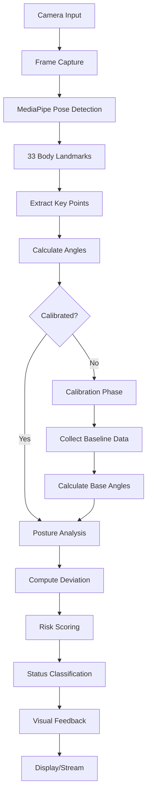

# 🧠 Real-Time Offline Ergonomic Risk Intelligence Using Edge AI

<div align="center">


**AI-Powered Real-Time Posture Monitoring & Ergonomic Risk Assessment**

*Privacy-First • Offline Processing • Low Latency • No Cloud Dependencies*

[Features](#-features) • [Tech Stack](#-tech-stack) • [Installation](#-installation) • [Usage](#-usage) • [Architecture](#-architecture)

</div>

---

## 📖 Overview

**Real-Time Offline Ergonomic Risk Intelligence** is an advanced Edge AI system that analyzes your posture in real-time using computer vision and machine learning. Unlike cloud-based solutions, all processing happens locally on your device, ensuring **complete privacy** and **zero latency**.

The system uses MediaPipe's pose estimation model to detect body landmarks, calculate neck and torso angles, and provide instant feedback about your ergonomic health with a dynamic risk score.

### 🎯 Key Highlights

- 🔒 **100% Offline** - No internet required, all processing on-device
- ⚡ **Real-Time Analysis** - Instant posture feedback with <100ms latency
- 🎯 **Smart Calibration** - Adapts to your natural sitting posture
- 📊 **Health Risk Scoring** - Dynamic 0-100 risk assessment
- 🖥️ **Multiple Interfaces** - CLI tool, Web dashboard, and Desktop app
- 🧠 **Edge AI** - Powered by MediaPipe and OpenCV
- 🎨 **Modern UI** - Beautiful, responsive dashboard design

---

## ✨ Features

| Feature | Description |
|---------|-------------|
| **Real-Time Pose Detection** | Uses MediaPipe to track 33 body landmarks at 30+ FPS |
| **Smart Calibration** | 5-second calibration adapts to your natural posture |
| **Risk Scoring** | Dynamic health risk score (0-100) based on posture deviation |
| **Visual Feedback** | Color-coded status (GOOD/POOR/RISKY) with live skeleton overlay |
| **Duration Tracking** | Monitors time spent in good vs poor posture |
| **Multiple Modes** | CLI (posture_coach.py), Web (server.py), Desktop (dashboard.py) |
| **Smooth Analytics** | 10-frame buffer for stable, smooth score updates |
| **Privacy First** | Zero data leaves your device - complete offline operation |

---

## 🛠️ Tech Stack

### Core Technologies

<div align="center">

| Technology | Purpose | Badge |
|:----------:|:-------:|:-----:|
| **Python** | Core Language |  |
| **OpenCV** | Computer Vision |  |
| **MediaPipe** | Pose Estimation |  |
| **NumPy** | Numerical Computing |  |

</div>

### Frontend & UI

<div align="center">

| Technology | Purpose | Badge |
|:----------:|:-------:|:-----:|
| **Flask** | Web Server |  |
| **JavaScript** | Frontend Logic |  |
| **HTML5** | Structure |  |
| **CSS3** | Styling |  |
| **PyQt5** | Desktop GUI |  |

</div>

### AI & Machine Learning

<div align="center">

| Component | Description |
|:---------:|:-----------:|
| **MediaPipe Pose** | Pre-trained pose estimation model for landmark detection |
| **Custom Analyzer** | Smart calibration and posture classification algorithm |
| **Score Smoothing** | 10-frame buffer for stable risk score calculation |
| **Angle Computation** | Real-time neck and torso angle measurement |

</div>

---

## 📁 Project Structure

```
Real-Time-Offline-Ergonomic-Risk-Intelligence-Using-Edge-AI/
│
├── 📄 posture_coach.py          # CLI version - Standalone OpenCV window
│   └── Features: Basic pose detection, real-time feedback, visual overlay
│
├── 🌐 server.py                 # Web server - Flask-based REST API
│   └── Features: Video streaming, REST endpoints, multi-client support
│
├── 🖥️ dashboard.py              # Desktop app - PyQt5 GUI application
│   └── Features: Native UI, threaded processing, professional interface
│
├── 📄 index.html                # Web dashboard frontend
│   └── Modern, responsive UI with real-time metrics
│
├── 🎨 style.css                 # Dashboard styling
│   └── Dark theme, glassmorphism effects, animations
│
├── ⚡ app.js                    # Frontend logic
│   └── API polling, UI updates, camera controls
│
├── 📋 requirements.txt          # Python dependencies
│   └── opencv-python, mediapipe, numpy, PyQt5, Flask
│
└── 📖 README.md                 # This file
```

### Architecture Components

#### 1. **Posture Analyzer** (Core Engine)
- **Calibration Phase**: 5-second baseline collection
- **Analysis Phase**: Continuous angle comparison and scoring
- **Risk Classification**: GOOD (<40 risk) | POOR (40-70) | RISKY (>70)

#### 2. **Video Processing Pipeline**
```
Camera → Frame Capture → RGB Conversion → MediaPipe Pose Detection 
→ Landmark Extraction → Angle Calculation → Posture Analysis 
→ Risk Scoring → Visual Overlay → Display/Stream
```

#### 3. **Frontend Dashboard**
- **Real-time polling**: 100ms intervals for live updates
- **Smooth animations**: CSS transitions and score ring
- **Responsive design**: Works on desktop and tablet
- **Status indicators**: Color-coded feedback system

---

## 💻 Installation

### Prerequisites

- Python 3.8 or higher
- Webcam or camera device
- 4GB RAM minimum (8GB recommended)
- Windows, macOS, or Linux

### Step 1: Clone the Repository

```bash
git clone https://github.com/Kamaleshkamalesh2005/Real-Time-Offline-Ergonomic-Risk-Intelligence-Using-Edge-AI.git
cd Real-Time-Offline-Ergonomic-Risk-Intelligence-Using-Edge-AI
```

### Step 2: Create Virtual Environment (Recommended)

```bash
# Create virtual environment
python -m venv venv

# Activate virtual environment
# On Windows:
venv\Scripts\activate
# On macOS/Linux:
source venv/bin/activate
```

### Step 3: Install Dependencies

```bash
pip install -r requirements.txt
```

### Dependencies Installed:
- `opencv-python==4.8.1.78` - Computer vision library
- `mediapipe==0.10.8` - Pose estimation model
- `numpy==1.24.3` - Numerical computing
- `PyQt5==5.15.9` - Desktop GUI framework (for dashboard.py)
- `flask` - Web server (for server.py)
- `flask-cors` - CORS support for web API

---

## 🚀 Usage

The system provides **three different interfaces** to suit your needs:

### 1️⃣ CLI Mode (OpenCV Window)

**Best for**: Quick testing, simple usage, minimal overhead

```bash
python posture_coach.py
```

**Features**:
- Opens a native OpenCV window
- Real-time pose detection overlay
- On-screen status and score display
- Press `ESC` to exit

**Screenshot Placeholder**:
```
[CLI Mode Screenshot]
→ Add screenshot showing OpenCV window with skeleton overlay
```

---

### 2️⃣ Web Dashboard Mode (Recommended)

**Best for**: Professional use, remote monitoring, modern UI

```bash
python server.py
```

Then open your browser and navigate to:
```
http://localhost:5000
```

**Features**:
- 🎨 Beautiful dark-themed dashboard
- 📊 Real-time metrics and analytics
- 📹 Live video feed with skeleton overlay
- 🎯 Health risk score with circular progress
- ⏱️ Duration tracking (good vs poor posture)
- 🎮 Camera toggle controls
- 📱 Responsive design

**API Endpoints**:
- `GET /` - Dashboard HTML page
- `GET /api/status` - JSON status data
- `GET /api/video_feed` - MJPEG video stream
- `GET /api/health` - Server health check

**Screenshot Placeholders**:

#### Dashboard Main View
```
[Dashboard Screenshot]
→ Add full dashboard screenshot showing:
  - Live video feed
  - Posture status card
  - Health risk score
  - Duration metrics
  - System info
```

#### Calibration Phase
```
[Calibration Screenshot]
→ Add screenshot showing calibration overlay with progress bar
```

#### Good Posture Detection
```
[Good Posture Screenshot]
→ Add screenshot showing GREEN status and low risk score
```

#### Poor/Risky Posture Alert
```
[Risky Posture Screenshot]
→ Add screenshot showing RED/AMBER status and high risk score
```

---

### 3️⃣ Desktop Application (PyQt5)

**Best for**: Native desktop experience, no browser needed

```bash
python dashboard.py
```

**Features**:
- 🖥️ Native desktop application
- 🎨 Professional PyQt5 interface
- 🔄 Threaded video processing
- 📊 Real-time analytics cards
- 🎯 Circular progress widget
- ⚡ High performance

**Screenshot Placeholder**:
```
[Desktop App Screenshot]
→ Add screenshot showing PyQt5 desktop application
```

---

## 🏗️ Architecture

### System Workflow



### Posture Analysis Algorithm

1. **Landmark Detection**
   - Uses MediaPipe to detect 33 body landmarks
   - Focuses on: Left Ear, Left Shoulder, Left Hip
   
2. **Angle Calculation**
   ```python
   neck_angle = angle(shoulder, ear)    # Head tilt
   torso_angle = angle(hip, shoulder)   # Back slouch
   ```

3. **Calibration (5 seconds)**
   - Collects baseline angles for natural posture
   - Averages ~150 frames for stable baseline
   
4. **Risk Assessment**
   - Compares current angles vs baseline
   - Calculates deviation score
   - Applies smoothing buffer (10 frames)
   
5. **Status Classification**
   - **GOOD**: Low deviation, neck < 40°, torso < 10°
   - **POOR**: Moderate deviation, risk score 40-70
   - **RISKY**: High deviation, risk score > 70

### Color Coding System

| Status | Color | Risk Score | Action |
|--------|-------|------------|--------|
| 🟢 GOOD | Green | 0-40 | Keep it up! |
| 🟡 POOR | Amber | 40-70 | Straighten up |
| 🔴 RISKY | Red | 70-100 | Immediate correction needed |

---

## 📸 Live Website Screenshots

> **Note**: Add your actual screenshots here by replacing the placeholders below

### Main Dashboard

*Caption: Real-time posture monitoring dashboard with live video feed and analytics*

### Calibration Process

*Caption: Smart calibration system adapting to user's natural posture*

### Good Posture Detection

*Caption: System detecting good posture with low risk score*

### Poor Posture Alert

*Caption: Real-time alert for poor posture with correction guidance*

### Analytics View

*Caption: Detailed posture analytics with duration tracking*

---

## ⚙️ System Requirements

### Minimum Requirements
- **OS**: Windows 10, macOS 10.14+, Ubuntu 18.04+
- **CPU**: Dual-core processor (Intel i3 or equivalent)
- **RAM**: 4GB
- **Camera**: 720p webcam
- **Python**: 3.8+
- **Storage**: 500MB free space

### Recommended Requirements
- **OS**: Windows 11, macOS 12+, Ubuntu 20.04+
- **CPU**: Quad-core processor (Intel i5 or equivalent)
- **RAM**: 8GB
- **Camera**: 1080p webcam
- **Python**: 3.10+
- **Storage**: 1GB free space

---

## 🎓 How It Works

### MediaPipe Pose Estimation
MediaPipe Pose is a ML solution that uses BlazePose model to detect 33 3D landmarks on the body:

- **Upper Body**: Eyes, Ears, Nose, Shoulders, Elbows, Wrists
- **Lower Body**: Hips, Knees, Ankles, Feet
- **Torso**: Shoulder line, hip line

### Posture Metrics

1. **Neck Angle** (Head Forward Posture)
   - Measured between shoulder midpoint and ear midpoint
   - Ideal: < 30°
   - Poor: > 40°
   
2. **Torso Angle** (Slouching)
   - Measured between hip midpoint and shoulder midpoint
   - Ideal: < 5°
   - Poor: > 10°

3. **Health Risk Score**
   ```
   Risk Score = (neck_deviation × 2) + (torso_deviation × 1.5)
   ```
   - Smoothed over 10-frame window
   - Range: 0-100
   - Updates in real-time

---

## 🔧 Configuration

### Adjusting Sensitivity

Edit the thresholds in `PostureAnalyzer.analyze()` method:

```python
# In server.py or posture_coach.py
if neck_angle < 40 and torso_angle < 10:  # Good posture thresholds
    status = "GOOD"
```

### Changing Calibration Duration

```python
# In PostureAnalyzer.__init__()
self.calibration_frames = int(5 * fps)  # Change 5 to desired seconds
```

### API Polling Interval

```javascript
// In app.js
CONFIG = {
    API_POLL_INTERVAL: 100,  // Change to desired milliseconds
}
```

---

## 🤝 Contributing

Contributions are welcome! Here's how you can help:

1. **Fork** the repository
2. **Create** a feature branch (`git checkout -b feature/AmazingFeature`)
3. **Commit** your changes (`git commit -m 'Add some AmazingFeature'`)
4. **Push** to the branch (`git push origin feature/AmazingFeature`)
5. **Open** a Pull Request

### Areas for Contribution
- 📱 Mobile app version (React Native)
- 🔔 Desktop notifications for poor posture
- 📈 Historical data tracking and charts
- 🌍 Multi-language support
- 🎯 Additional posture metrics (e.g., shoulder alignment)
- 🧪 Unit tests and integration tests
- 📚 Improved documentation

---

## 📝 License

This project is open source and available under the [MIT License](LICENSE).

---

## 👨‍💻 Author

**Kamalesh**

- GitHub: [@Kamaleshkamalesh2005](https://github.com/Kamaleshkamalesh2005)
- Project: [Real-Time Offline Ergonomic Risk Intelligence](https://github.com/Kamaleshkamalesh2005/Real-Time-Offline-Ergonomic-Risk-Intelligence-Using-Edge-AI)

---

## 🙏 Acknowledgments

- **MediaPipe Team** - For the amazing pose estimation model
- **OpenCV Community** - For the powerful computer vision library
- **Flask Team** - For the lightweight web framework
- **PyQt Team** - For the cross-platform GUI toolkit

---

## 📞 Support

If you found this project helpful, please consider:
- ⭐ **Starring** the repository
- 🐛 **Reporting** issues
- 💡 **Suggesting** new features
- 🔀 **Contributing** code improvements

---

## 🚀 Future Roadmap

- [ ] Mobile app (iOS/Android)
- [ ] Cloud sync (optional) for multi-device
- [ ] Advanced analytics dashboard
- [ ] Exercise recommendations
- [ ] Posture correction exercises
- [ ] Voice alerts
- [ ] Integration with fitness trackers
- [ ] Machine learning model fine-tuning
- [ ] Multi-person detection support
- [ ] Standing desk posture analysis

---

<div align="center">

**Made with ❤️ and Edge AI**

*Protecting your health, one posture at a time* 🧘‍♂️

[⬆ Back to Top](#-real-time-offline-ergonomic-risk-intelligence-using-edge-ai)

</div>
